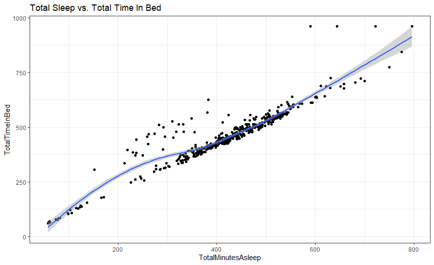
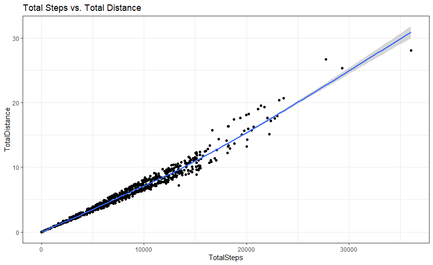
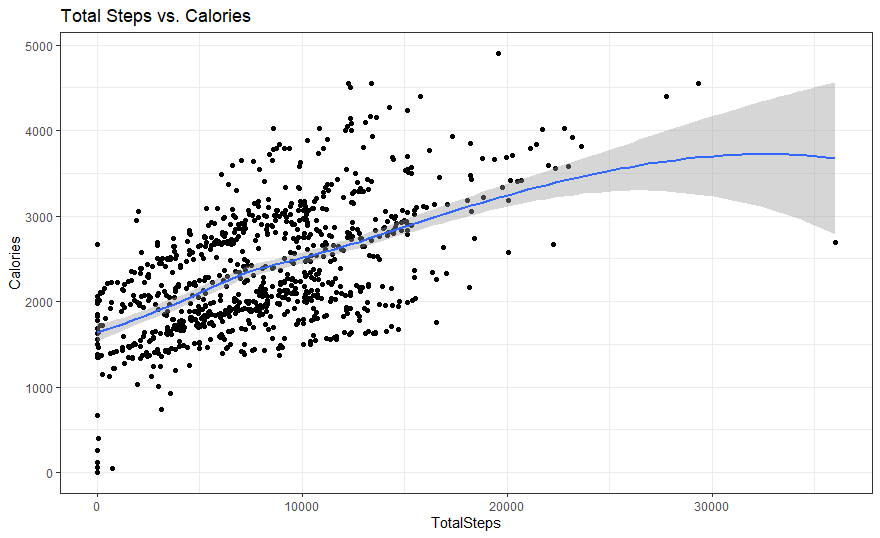

Company Background

Bellabeat, founded in 2013, is a high tech company developing wellness tracking devices for women. By 2016, Bellabeat launched multiple products that allowed them to expand their business globally. The products became available through online retailers and on their own e-commerce channel. These products include a wellness tracker, a wellness watch, and a tech-smart water bottle that all connect to the Bellabeat app.

The Bellabeat app provides users with health data related to their activity, sleep, stress, menstrual cycle, and mindfulness habits. This app allows users to better understand their current habits and make healthy decisions. A subscription-based membership is offered to users, giving them 24/7 access to fully personalized guidance on nutrition, activity, sleep, health and beauty, and mindfulness based on their lifestyle and goals.

The company has invested in traditional advertising media, such as radio, out-of-home billboards, print, and television, but focuses on digital marketing extensively. Digital marketing includes Google Search, video ads on Youtube and Google Display Network, and consumer engagement on social media platforms. A presence is maintained year-round on their Facebook and Instagram pages and they consistently engage with consumers on Twitter.

2. ASK

2.1 The Business Task Analyze collected data on smart device usage used by non-Bellabeat consumers to identify trends that can be applied toward Bellabeat's marketing strategy.

2.2 The Stakeholders Urška Sršen: Co-founder and Chief Creative Officer Sando Mur: Mathematician and Bellabeat's co-founder; key member of the Bellabeat executive team Bellabeat marketing analytics team

3. PREPARE

3.1 Data Sources

Data Organization: This data can be found on the Kaggle public data set. There are 18 CSV documents. This data is structured and are presented in a long data format.

Data Credibility: Even though this data set is first party data being collected directly from the FitBit Fitness Tracker, it is insufficient data. Firstly this data shows fitness activity for thirty-three people which is too small of a sample size. Secondly, demographic information such as gender, age and health, is unavailable. The target audience for Bellabeat is women, although we do not know if any of these participants are women.

Privacy and Accessibility: The owner of this data set has allowed it to exist in the public domain. Anyone may use this data if they so choose.

Sort and Filter: I will be analyzing the physical activity and sleep monitoring for these participants.

3.2 Loading Packages

Setting up my R environment by loading the 'tidyverse', 'ggplot2', 'here', and 'janitor' packages

```{r loading packages}
install.packages('ggplot2')
library('ggplot2')
install.packages('tidyverse')
library('tidyverse')
install.packages('here')
library('here')
install.packages('janitor')
library('janitor')
```

3.3 Assigning names and importing files into a data frame.

One thing that the Bellabeat app does is measure stress. There are several factors that can be used to measure stress. A few of those factors have been provided to us with these data frames. Daily activity, sleep patterns, and heart rate can all be tracked when measuring stress. Unfortunately, for the heart rate data frame we only have information on seven participants, so we will be unable to analyze that data frame. We can look at the daily activity, the daily sleep data frames, and the intensity data frame.

```{r}
daily_activity <- read.csv("dailyActivity_merged_saved.csv", header = TRUE, sep = ",")
intensity <- read.csv("minuteIntensitiesNarrow_merged_saved.csv", header= TRUE, sep = ",")
daily_sleep <- read.csv("sleepDay_merged_saved.csv", header = TRUE, sep = ",")
```

3.4 See how many participants each data set includes.

```{r}
n_distinct(intensity$Id)
n_distinct(daily_activity$Id)
n_distinct(daily_sleep$Id)
```

3.5 Check to see if there are any missing values.

```{r}
daily_activity %>% 
  select_all() %>% 
  filter(!complete.cases(.))
```

```{r}
intensity %>% 
  select_all() %>% 
  filter(!complete.cases(.))
```

```{r}
daily_sleep %>% 
  select_all() %>% 
  filter(!complete.cases(.))
```

3.6 Check for duplicates.

```{r}
sum(duplicated(daily_activity))
sum(duplicated(intensity))
sum(duplicated(daily_sleep))
```

The daily_sleep data frame shows 3 duplicates. Here we remove the duplicates.

```{r}
daily_sleep <- unique(daily_sleep)
sum(duplicated(daily_sleep))
```

4. PROCESS

4.1 View and change the formatting for the date.

```{r}
View(daily_activity)
glimpse(daily_activity)
daily_activity$ActivityDate <- as.Date(daily_activity$ActivityDate, format="%m/%d/%Y")
class(daily_activity$ActivityDate)
```

```{r}
View(intensity)
glimpse(intensity)
intensity$ActivityDate <- as.Date(intensity$ActivityDate, format= "%m/%d/%Y")
class(intensity$ActivityDate)
```

```{r}
View(daily_sleep)
glimpse(daily_sleep)
daily_sleep$SleepDay <- as.Date(daily_sleep$SleepDay, format= "%m/%d/%Y")
class(daily_sleep$SleepDay)
```

4.2 Change column name in daily_sleep. From SleepDay to ActivityDate.

```{r}
colnames(daily_sleep)[2] = "ActivityDate"
```

5. ANALYZE

5.1 Data Summary

```{r}
daily_activity %>% 
  select(TotalSteps, TotalDistance, VeryActiveMinutes, FairlyActiveMinutes, LightlyActiveMinutes, SedentaryMinutes, Calories) %>% 
  drop_na %>% 
  summary()
```

1.  The average steps per day for each user is 7,638. This is lower from the daily 10,000 steps recommended by the Mayo Clinic.
2.  The difference between the mean and the median for Very Active Minutes and Fairly Active Minutes is higher. This tells us that few users have longer active minutes and most users have shorter active minutes.

```{r}
intensity %>% 
  select(ActivityMinute, Intensity, ActivityMinutes) %>% 
  drop_na %>% 
  summary()
```

```{r}
daily_sleep %>% 
  select(TotalSleepRecords, TotalMinutesAsleep, TotalTimeInBed) %>% 
  drop_na %>% 
summary()
```

1.  There is at least one sleep record for each day for every user.
2.  On average, each user is getting 6.98 hours of sleep each night. According to the Mayo Clinic, adults (18 years and above) should be getting 7 or more hours each night. It looks like each user is getting just enough sleep.

5.2 Correlations

```{r}
cor(daily_sleep[c("TotalMinutesAsleep", "TotalTimeInBed")])
```

```{r}
ggplot(data=daily_sleep, aes(x=TotalMinutesAsleep, y=TotalTimeInBed))+
  geom_point() + geom_smooth() +
  labs(title = "Total Sleep vs. Total Time In Bed")+
  theme_bw()
```



1.  There is a positive correlation between Total Minutes Asleep and Total Time In Bed. Data points are so close together, so we can assume that there is little difference between time just spent in bed and time slept.
2.  The plot shows data points going upward close to a 45 degree angle. Points are mostly clustered together, telling us that users are sleeping the majority of the time they are in bed.

```{r}
cor(daily_activity[c("TotalSteps", "TotalDistance")])
```

```{r}
ggplot(data=daily_activity, aes(x=TotalSteps, y=TotalDistance))+
  geom_point() + geom_smooth() +
  labs(title = "Total Steps vs. Total Distance")+
  theme_bw()
```



1.  There is a positive correlation between Total Steps and Total Distance. Data points are so close together, so we can assume that there is little difference between the total number of steps made and the distance each user has gone.
2.  The plot shows data points going upward close to a 45 degree angle. There is some scattered points as the Total Steps and Total Distance increases. This lets us know that there were a few users that had higher intensities.

```{r}
cor(daily_activity[c("TotalSteps", "Calories")])
```

```{r}
ggplot(data=daily_activity, aes(x=TotalSteps, y=Calories)) +
  geom_point() + geom_smooth() + 
  labs(title = "Total Steps vs. Calories") +
  theme_bw()
```



1.  Here it is confirmed that the more steps that are taken the more calories that are burned.

6. ACT

Recommendations

Review findings:

Users take 7,638 steps per day on average, lower than the daily 10,000 steps recommended by CDC.

Most users demonstrate their higher activity level to occur for a shorter amount of time.

Our results show us that users sleep on average 6.98 hours a day. This is less then the recommended hours of 7 to 8 hours of sleep. We can also see that sleep in consistent, based on the small difference between the time spent in bed and the time slept in bed.

A correlation can be identified between daily steps and total distance as well as daily steps and calories.

Based on the findings, here are some recommendations.

The App could help the users set up a profile that would track their personal goals. It could send alerts to suggest activities for users to do if they appear to be seated or inactive for longer periods of time. This could help increase activity, and possibly encourage users to track more like their activity, weight, and heart rate information.

For users who would like to increase their quality of sleep, the App could also track their sleep patterns and make suggestions. The App could recommend a bedtime and alert the user when it is time to get ready for bed. Features like assisted meditation, breathing exercises, and peaceful sounds are all techniques that could prepare the user to fall asleep.
